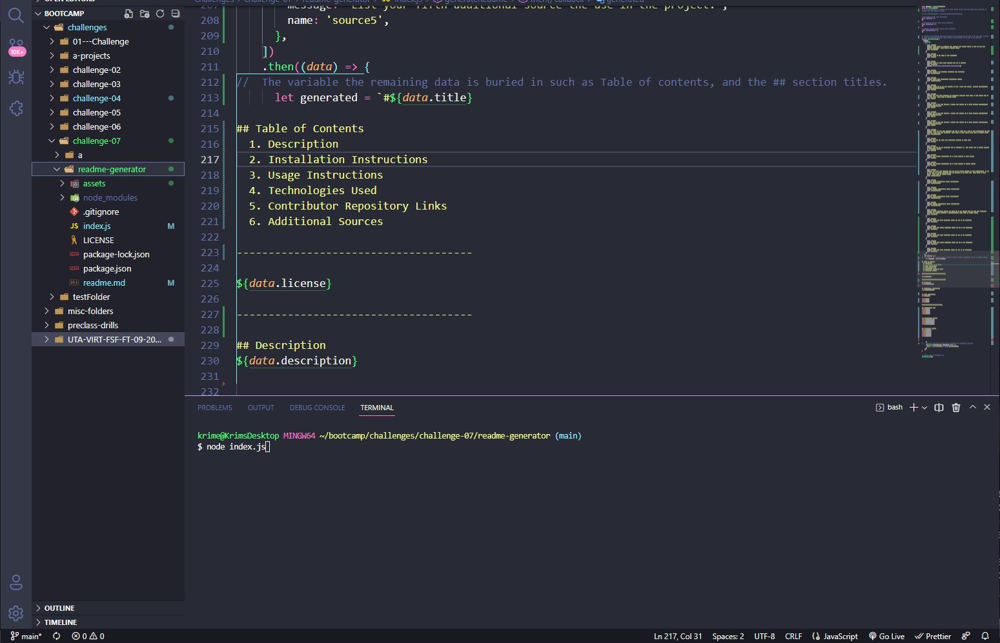
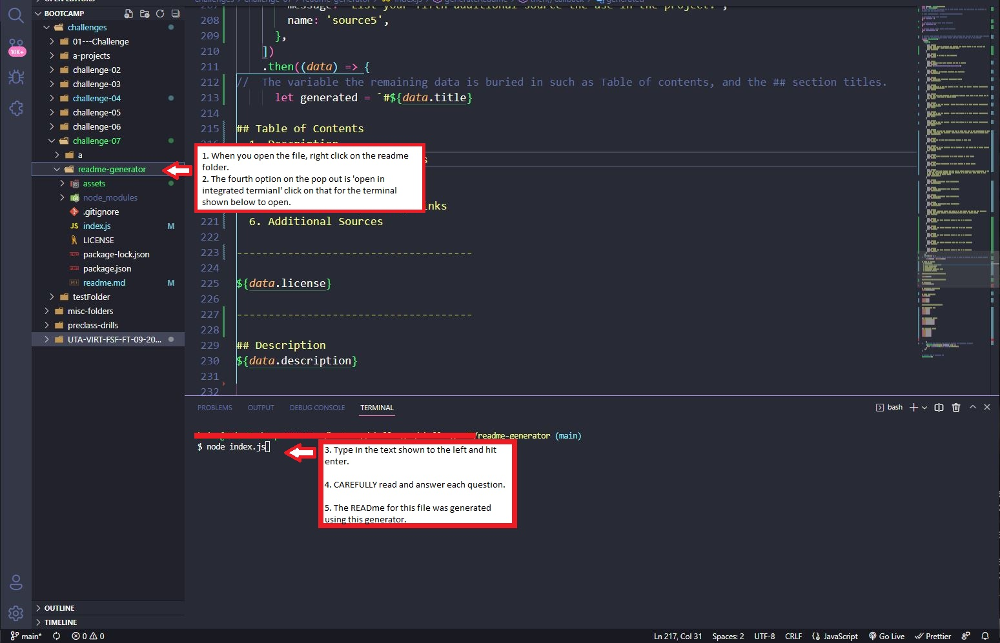

# Readme Generator

## Table of Contents
  1. [Description](#description)
  2. [Assigned Task](#assigned-tasks)
  3. [Installation Instructions](#installation-instructions)
  4. [Usage Instructions](#usage-instructions)
  5. [Technologies Used](#technologies-used)
  6. [Contributor Repository Links](#contributor-repository-links)
  7. [Additional Sources](#additional-sources)

-------------------------------------

## The MIT License

[]

https://lbesson.mit-license.org/

The MIT License (MIT)
Copyright © 2022 Lilian Besson (Naereen), https://bitbucket.org/lbesson/ <naereen at crans dot org>

Permission is hereby granted, free of charge, to any person obtaining a copy of this software and associated documentation files (the “Software”), to deal in the Software without restriction, including without limitation the rights to use, copy, modify, merge, publish, distribute, sublicense, and/or sell copies of the Software, and to permit persons to whom the Software is furnished to do so, subject to the following conditions:

The above copyright notice and this permission notice shall be included in all copies or substantial portions of the Software.

THE SOFTWARE IS PROVIDED “AS IS”, WITHOUT WARRANTY OF ANY KIND, EXPRESS OR IMPLIED, INCLUDING BUT NOT LIMITED TO THE WARRANTIES OF MERCHANTABILITY, FITNESS FOR A PARTICULAR PURPOSE AND NONINFRINGEMENT. IN NO EVENT SHALL THE AUTHORS OR COPYRIGHT HOLDERS BE LIABLE FOR ANY CLAIM, DAMAGES OR OTHER LIABILITY, WHETHER IN AN ACTION OF CONTRACT, TORT OR OTHERWISE, ARISING FROM, OUT OF OR IN CONNECTION WITH THE SOFTWARE OR THE USE OR OTHER DEALINGS IN THE SOFTWARE.

-------------------------------------

## Description
A quick and easy way to generate a high quality readme by answering a series of questions.  By opening the terminal in throught the folder associated with this project.  From there, by typing 'node index.js' and hitting enter/return the questions will appear one after the other.  Once you have made it through the questions a high quality readme file will be written to the subfolder where the JS file is saved. 

## Assigned Tasks
  1. Write a Javascript file that uses inquirer to prompt questions to the user.
  2. write up a series of prompts that will apply the given answers to data that will then be written to a Readme file.
  3. Create and apply a video showing instructions on how to use the application.

-------------------------------------

### Installation Instructions
Installation of the readme Generator can be completed through a github download of the files related to it. 

-------------------------------------

### Usage Instructions

-------------------------------------

#### Technologies Used
1. JavaScript
2. VsCode
3. Node
4. Inquirer

#### Contributors githubs
1. https://github.com/Krimeas

#### Additional Sources
1. Source of the Badges for the License: https://naereen.github.io/badges/
2. Markdown link help: https://gist.github.com/jonschlinkert/ac5d8122bfaaa394f896#sub-heading

Task details and initial code supplied by UT Austin Coding Bootcamp.

      
